| Nama      | ROSWANDA NURAINI |
| ----------- | ----------- |
| NIM     | 3122102328       |
| Kelas   | TI.22.A.3        |
| Tugas   | UTS PENGELOLAAN CITRA        |
# RGB ke HSV
Biasanya objek dalam gambar mempunyai warna (rona) dan luminositas yang berbeda, sehingga fitur tersebut dapat digunakan untuk memisahkan area berbeda pada gambar. Dalam representasi RGB, rona dan luminositas dinyatakan sebagai kombinasi linier saluran R,G,B, sedangkan saluran tersebut berhubungan dengan saluran tunggal gambar HSV (saluran Hue dan Nilai). Segmentasi sederhana pada gambar kemudian dapat dilakukan secara efektif hanya dengan melakukan ambang batas saluran HSV.
```bash
import matplotlib.pyplot as plt

from skimage import data
from skimage.color import rgb2hsv
```
Pertama-tama kita memuat gambar RGB dan mengekstrak saluran Hue dan Value:
```bash
rgb_img = data.coffee()c
hsv_img = rgb2hsv(rgb_img)
hue_img = hsv_img[:, :, 0]
value_img = hsv_img[:, :, 2]

fig, (ax0, ax1, ax2) = plt.subplots(ncols=3, figsize=(8, 2))

ax0.imshow(rgb_img)
ax0.set_title("RGB image")
ax0.axis('off')
ax1.imshow(hue_img, cmap='hsv')
ax1.set_title("Hue channel")
ax1.axis('off')
ax2.imshow(value_img)
ax2.set_title("Value channel")
ax2.axis('off')

fig.tight_layout()
```

Kami kemudian menetapkan ambang batas pada saluran Hue untuk memisahkan cangkir dari latar belakang:
```bash
fig, ax0 = plt.subplots(figsize=(4, 3))

value_threshold = 0.10
binary_img = (hue_img > hue_threshold) | (value_img < value_threshold)

ax0.imshow(binary_img)
ax0.set_title("Hue and value thresholded image")
ax0.axis('off')

fig.tight_layout()
plt.show()
```
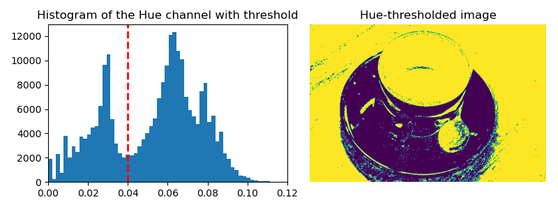
```bash
fig, ax0 = plt.subplots(figsize=(4, 3))

value_threshold = 0.10
binary_img = (hue_img > hue_threshold) | (value_img < value_threshold)

ax0.imshow(binary_img)
ax0.set_title("Hue and value thresholded image")
ax0.axis('off')

fig.tight_layout()
plt.show()
```
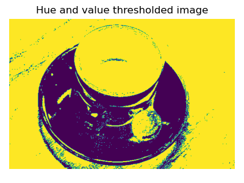

# Menghitung Histrogram
## Persyaratan
```bash 
from matplotlib import pyplot
from os.path import basename
from os.path import splitext
from PIL import Image

def get_file_name(file_path):
    # https://stackoverflow.com/a/678266/9157799
    return splitext(basename(file_path))[0]

def tampilkan_histogram(r, g, b, gambar):
    intensitas = list(range(256))
    lebar_bar = 0.3

    # https://stackoverflow.com/q/9304408/9157799
    intensitas = [i-lebar_bar for i in intensitas]
    # https://stackoverflow.com/q/14270391/9157799
    pyplot.bar(intensitas, r, width=lebar_bar, color='r')

    intensitas = [i+lebar_bar for i in intensitas]
    pyplot.bar(intensitas, g, width=lebar_bar, color='g')

    intensitas = [i+lebar_bar for i in intensitas]
    pyplot.bar(intensitas, b, width=lebar_bar, color='b')

    pyplot.title('Histogram ' + gambar)
    pyplot.xlabel('Intensitas')
    pyplot.ylabel('Kemunculan')
    pyplot.legend(['R', 'G', 'B'])
    pyplot.show()

def histogram(gambar):
    GAMBAR = Image.open(gambar)
    PIXEL = GAMBAR.load()

    ukuran_horizontal = GAMBAR.size[0]
    ukuran_vertikal = GAMBAR.size[1]

    gambar_r = Image.new('RGB', (ukuran_horizontal, ukuran_vertikal))
    pixel_r = gambar_r.load()

    gambar_g = Image.new('RGB', (ukuran_horizontal, ukuran_vertikal))
    pixel_g = gambar_g.load()

    gambar_b = Image.new('RGB', (ukuran_horizontal, ukuran_vertikal))
    pixel_b = gambar_b.load()

    # https://stackoverflow.com/q/10712002/9157799
    r = [0] * 256
    g = [0] * 256
    b = [0] * 256

    for x in range(ukuran_horizontal):
        for y in range(ukuran_vertikal):
            intensitas_r = PIXEL[x, y][0]
            intensitas_g = PIXEL[x, y][1]
            intensitas_b = PIXEL[x, y][2]
            r[intensitas_r] += 1
            g[intensitas_g] += 1
            b[intensitas_b] += 1
            pixel_r[x, y] = (intensitas_r, 0, 0)
            pixel_g[x, y] = (0, intensitas_g, 0)
            pixel_b[x, y] = (0, 0, intensitas_b)

    gambar_r.save('img/' + get_file_name(gambar) + '_r.jpg')
    gambar_g.save('img/' + get_file_name(gambar) + '_g.jpg')
    gambar_b.save('img/' + get_file_name(gambar) + '_b.jpg')

    tampilkan_histogram(r, g, b, gambar)


histogram('img/gambar.jpg')
histogram('img/gambar2.jpg')
```
## sample 1

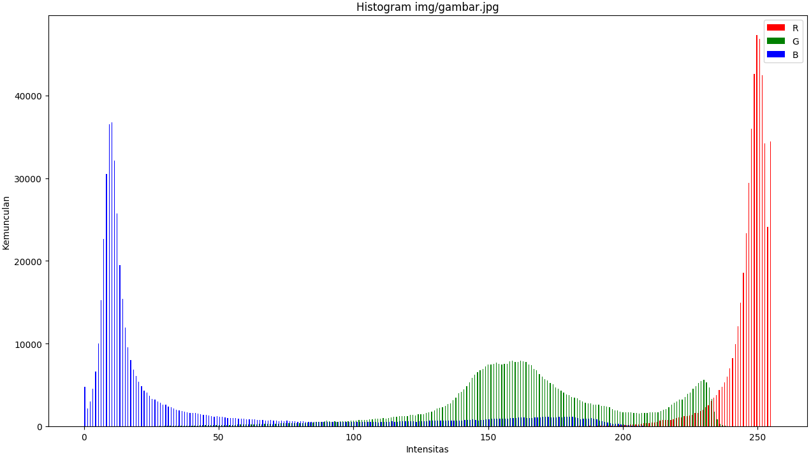
R | G | B
--- | - | -
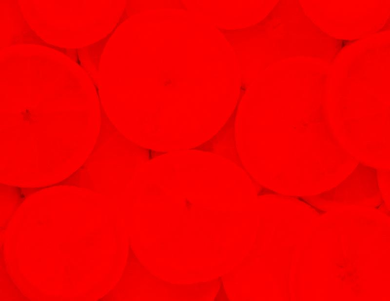 | 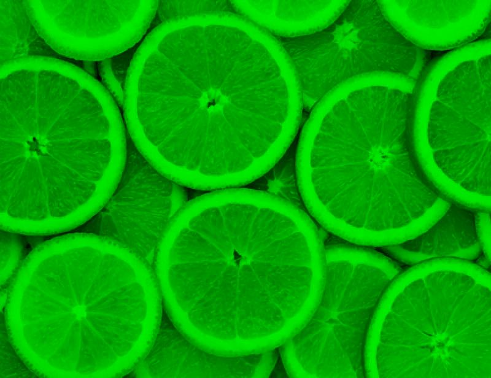 | 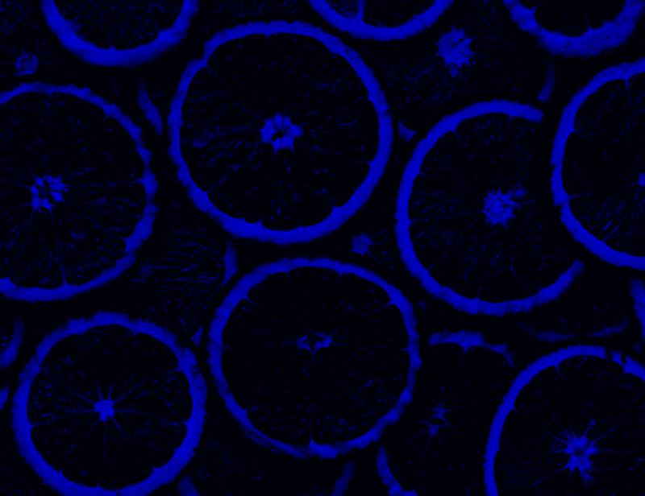
## sample 2

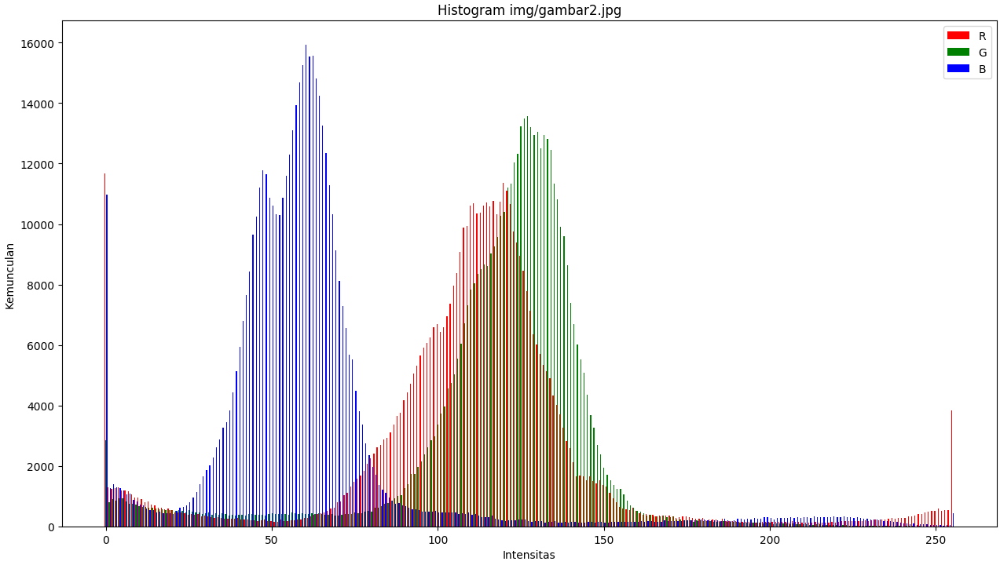
R | G | B
--- | - | -
 | 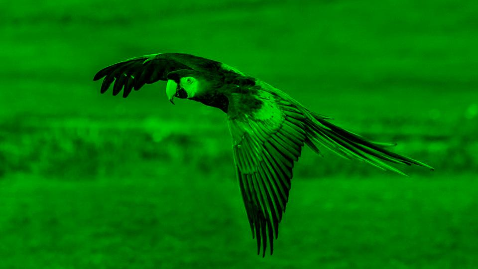 | 
# Brignest Dan Contras
Mengubah tingkat Kecerahan dan Kontras gambar apa pun adalah hal paling mendasar yang dilakukan setiap orang dengan sebuah gambar. Hal ini dimaksudkan untuk mengubah nilai setiap piksel suatu gambar dapat dilakukan dengan mengalikan atau membagi nilai piksel suatu gambar. Pada artikel ini, kita akan melihat bagaimana kita dapat mengimplementasikan teori kita dalam kode yang indah menggunakan OpenCV Python, 

Sebelum memulai mari kita coba memahami beberapa konsep dasar seperti apa itu kecerahan? Apa itu kontras? Apa itu piksel? Bagaimana dengan OpenCV?

Kecerahan: Saat kecerahan disesuaikan, seluruh rentang warna dalam gambar akan dimasukkan atau diturunkan.
Kontras: Bila penyesuaian kontras ditambahkan, nada tengah dihilangkan. Gambar akan memiliki persentase gelap atau hitam putih yang lebih tinggi atau sorotan dengan rona tengah minimal.
Piksel: Piksel biasanya digunakan untuk Merujuk pada resolusi tampilan monitor atau layar komputer. Semakin besar pikselnya, semakin besar detail gambarnya.
OpenCV: OpenCV adalah perpustakaan sumber terbuka yang sangat besar untuk visi komputer, pembelajaran mesin, dan pemrosesan gambar dan sekarang memainkan peran utama dalam pengoperasian waktu nyata
Agenda: Mempelajari cara mengatur tingkat kecerahan dan kontras suatu gambar menggunakan OpenCV.
```bash
import cv2
import numpy as np
from matplotlib import pyplot as plt

def adjust_brightness_contrast(image, brightness=0, contrast=0):
    """
    Menyesuaikan kecerahan dan kontras gambar.

    :param image: Input image (numpy array)
    :param brightness: Nilai kecerahan (-255 hingga 255)
    :param contrast: Nilai kontras (-127 hingga 127)
    :return: Gambar yang disesuaikan
    """
    if brightness != 0:
        if brightness > 0:
            shadow = brightness
            highlight = 255
        else:
            shadow = 0
            highlight = 255 + brightness
        alpha_b = (highlight - shadow) / 255
        gamma_b = shadow

        image = cv2.addWeighted(image, alpha_b, image, 0, gamma_b)

    if contrast != 0:
        f = 131 * (contrast + 127) / (127 * (131 - contrast))
        alpha_c = f
        gamma_c = 127 * (1 - f)

        image = cv2.addWeighted(image, alpha_c, image, 0, gamma_c)

    return image

def read_image(image_file, gray_scale=False):
    image_src = cv2.imread(image_file)
    if image_src is None:
        raise FileNotFoundError(f"File {image_file} tidak ditemukan.")
    if gray_scale:
        image_src = cv2.cvtColor(image_src, cv2.COLOR_BGR2GRAY)
    else:
        image_src = cv2.cvtColor(image_src, cv2.COLOR_BGR2RGB)
    return image_src

def plot_images(original, modified, title1="Original", title2="Modified", cmap_val=None):
    fig = plt.figure(figsize=(10, 10))

    ax1 = fig.add_subplot(1, 2, 1)
    ax1.axis("off")
    ax1.title.set_text(title1)
    ax1.imshow(original, cmap=cmap_val)

    ax2 = fig.add_subplot(1, 2, 2)
    ax2.axis("off")
    ax2.title.set_text(title2)
    ax2.imshow(modified, cmap=cmap_val)

    plt.show()

# Contoh penggunaan fungsi
image_file = r'c:\Users\LENOVO\Pictures\download.jpg'
image = read_image(image_file)
adjusted_image = adjust_brightness_contrast(image, brightness=50, contrast=30)

plot_images(image, adjusted_image, title1="Original Image", title2="Brightness & Contrast Adjusted")

# Contoh penggunaan dengan gambar grayscale
image_gray = read_image(image_file, gray_scale=True)
adjusted_image_gray = adjust_brightness_contrast(image_gray, brightness=50, contrast=30)

plot_images(image_gray, adjusted_image_gray, title1="Original Grayscale Image", title2="Brightness & Contrast Adjusted", cmap_val='gray')
```


# Contour
Ilustrasikan pembuatan plot kontur sederhana, kontur pada gambar dengan bilah warna untuk kontur, dan kontur yang diberi label.
```bash
import matplotlib.pyplot as plt
import numpy as np

import matplotlib.cm as cm

delta = 0.025
x = np.arange(-3.0, 3.0, delta)
y = np.arange(-2.0, 2.0, delta)
X, Y = np.meshgrid(x, y)
Z1 = np.exp(-X**2 - Y**2)
Z2 = np.exp(-(X - 1)**2 - (Y - 1)**2)
Z = (Z1 - Z2) * 2
```
Buat plot kontur sederhana dengan label menggunakan warna default. Argumen sebaris pada clabel akan mengontrol apakah label digambar di atas segmen garis kontur, menghilangkan garis di bawah label.
```bash
fig, ax = plt.subplots()
CS = ax.contour(X, Y, Z)
ax.clabel(CS, inline=True, fontsize=10)
ax.set_title('Simplest default with labels')
```

Label kontur dapat ditempatkan secara manual dengan memberikan daftar posisi (dalam koordinat data). Lihat Fungsi interaktif untuk penempatan interaktif.
```bash
fig, ax = plt.subplots()
CS = ax.contour(X, Y, Z)
manual_locations = [
    (-1, -1.4), (-0.62, -0.7), (-2, 0.5), (1.7, 1.2), (2.0, 1.4), (2.4, 1.7)]
ax.clabel(CS, inline=True, fontsize=10, manual=manual_locations)
ax.set_title('labels at selected locations')
```
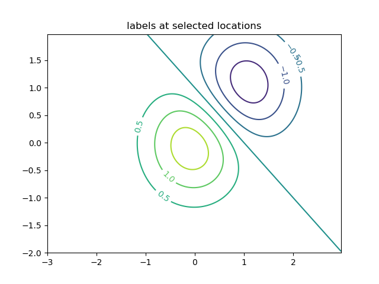
Anda dapat memaksa semua kontur memiliki warna yang sama.
```bash
fig, ax = plt.subplots()
CS = ax.contour(X, Y, Z, 6, colors='k')  # Negative contours default to dashed.
ax.clabel(CS, fontsize=9, inline=True)
ax.set_title('Single color - negative contours dashed')
```
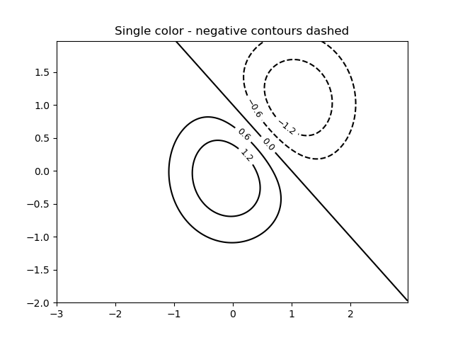
Anda dapat mengatur kontur negatif menjadi padat, bukan putus-putus:
```bash
plt.rcParams['contour.negative_linestyle'] = 'solid'
fig, ax = plt.subplots()
CS = ax.contour(X, Y, Z, 6, colors='k')  # Negative contours default to dashed.
ax.clabel(CS, fontsize=9, inline=True)
ax.set_title('Single color - negative contours solid')
```
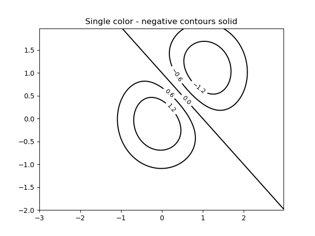
Dan Anda dapat menentukan warna kontur secara manual
```bash
fig, ax = plt.subplots()
CS = ax.contour(X, Y, Z, 6,
                linewidths=np.arange(.5, 4, .5),
                colors=('r', 'green', 'blue', (1, 1, 0), '#afeeee', '0.5'),
                )
ax.clabel(CS, fontsize=9, inline=True)
ax.set_title('Crazy lines')
```

Atau Anda bisa menggunakan peta warna untuk menentukan warna; peta warna default akan digunakan untuk garis kontur
```bash
fig, ax = plt.subplots()
im = ax.imshow(Z, interpolation='bilinear', origin='lower',
               cmap=cm.gray, extent=(-3, 3, -2, 2))
levels = np.arange(-1.2, 1.6, 0.2)
CS = ax.contour(Z, levels, origin='lower', cmap='flag', extend='both',
                linewidths=2, extent=(-3, 3, -2, 2))

# Thicken the zero contour.
lws = np.resize(CS.get_linewidth(), len(levels))
lws[6] = 4
CS.set_linewidth(lws)

ax.clabel(CS, levels[1::2],  # label every second level
          inline=True, fmt='%1.1f', fontsize=14)

# make a colorbar for the contour lines
CB = fig.colorbar(CS, shrink=0.8)

ax.set_title('Lines with colorbar')

# We can still add a colorbar for the image, too.
CBI = fig.colorbar(im, orientation='horizontal', shrink=0.8)

# This makes the original colorbar look a bit out of place,
# so let's improve its position.

l, b, w, h = ax.get_position().bounds
ll, bb, ww, hh = CB.ax.get_position().bounds
CB.ax.set_position([ll, b + 0.1*h, ww, h*0.8])

plt.show()
```
